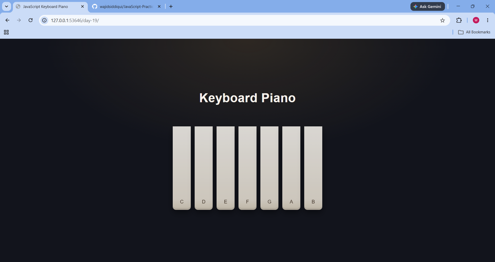

#  Keyboard Piano

A simple keyboard piano built using **HTML, CSS, and JavaScript**.

This project allows you to play piano notes either by clicking the piano keys with your mouse or by pressing keys on your keyboard.

##  Features

- Play piano notes using mouse clicks
- Play piano notes using keyboard
- Smooth key press animation
- Responsive design
- Simple and clean UI

##  Keyboard Controls

| Keyboard Key | Piano Note |
    a:"c",
    s:"d",
    d:"e",
    f:"f",
    g:"g",
    h:"a",
    j:"b"

##  Technologies Used

- HTML5
- CSS3
- JavaScript (DOM Manipulation)

##  Project Structure

day-19/
│── index.html
│── style.css
│── script.js
└── Sounds/
    ├── a.mp3
    ├── b.mp3
    ├── c.mp3
    ├── d.mp3
    ├── e.mp3
    ├── f.mp3
    └── g.mp3

##  Concepts Practiced

While building this project, I practiced:

- DOM Selection
- querySelectorAll()
- addEventListener()
- Mouse Events
- Keyboard Events
- Event Object (`e`)
- Dataset (`data-note`)
- Objects
- forEach()
- Audio API
- Template Literals
- CSS Flexbox

##  What I Learned

This project helped me understand how mouse events and keyboard events can be connected to the same functionality.

I also learned how to use custom data attributes (`data-note`), map keyboard keys using JavaScript objects, and play audio dynamically using the Audio API.

##  Preview

Day 19 of my JavaScript Practice Journey 🚀